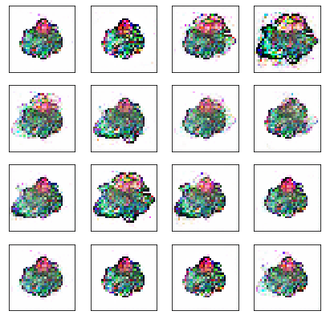
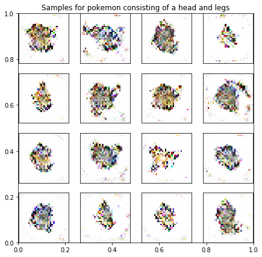

# PokeGan

Attempts to generate pokemon with a GAN. The outputs aren't spectacular. When
limiting the model to a family of pokemon the following images were generated.

A conditional GAN was also created to generate pokemon which had a particular body shape. Some results are shown below

These can be generated by running the two notebooks `pokegan` and `cgan` respectively.

## How to run

The data was sourced from [bulbapedia](https://bulbapedia.bulbagarden.net/wiki/List_of_Pok%C3%A9mon_by_shape). To extract the data, download the page and save it in `./data/raw/`. You can do this by right-clicking on the page and saving the HTML and the contents. This should produce a folder with all the contents of the page e.g. images, and a file with the HTML code.

Then from the root, run the command `python3 poke_ml/parser.py`. This will generate an index table containing information on all pokemon entries. It will be located at `./data/tables`. The relevant images will also be copied to a new folder `./data/images`. This is all the preparation necessary.

### Requirements

- python3
- requirements.txt
